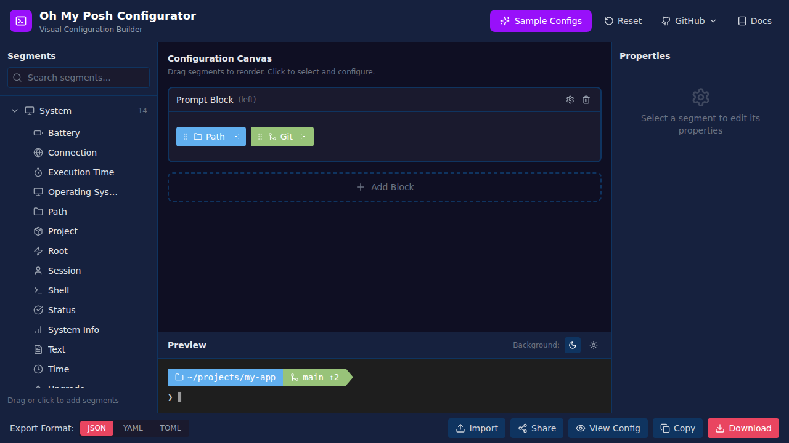

# Oh My Posh Visual Configurator ✨

<div align="center">


[](LICENSE)
[](https://configurator.ohmyposh.dev/)

**Design beautiful terminal prompts without touching configuration files**

[🚀 Launch App](https://configurator.ohmyposh.dev/) • [📖 Documentation](https://ohmyposh.dev/docs/) • [💬 Discussions](https://github.com/jamesmontemagno/ohmyposh-configurator/discussions)



</div>

---

## 🎯 What is Oh My Posh Configurator?

The **Oh My Posh Visual Configurator** is a modern, intuitive web application that lets you design and customize your terminal prompt visually. No more manual JSON editing or trial-and-error configuration—just drag, drop, customize, and export!

Perfect for developers, DevOps engineers, and anyone who wants a beautiful, informative terminal prompt for PowerShell, Bash, Zsh, Fish, or any shell supported by [Oh My Posh](https://ohmyposh.dev/).

## ✨ Features

- 🎨 **103+ Segments**: Browse comprehensive segment library organized in 8 categories with detailed properties and options
- 🖱️ **Drag & Drop Interface**: Intuitive visual editor with real-time updates
- ⚡ **Live Preview**: See your prompt instantly with sample data and powerline/diamond styles
- 🎛️ **Full Customization**: Configure colors, templates, styles, and alignment with inline documentation
- 🚀 **Progressive Disclosure**: Advanced features hidden by default with settings dialog to show/hide complexity as needed
- 🎯 **Smart Defaults**: Auto-applied cache settings, intelligent feature detection on import
- 💡 **Command Tooltips**: Configure command-triggered custom prompts (e.g., show git status when typing `git`)
- 📚 **Segment Documentation**: Built-in properties and options reference for every segment
- 📦 **Import & Export**: Support for JSON, YAML, and TOML formats
- 💾 **Auto-Save**: Never lose your work with automatic browser storage
- 🎯 **Sample Configs**: Start quickly with 6 pre-built professional templates
- 👥 **Community Themes**: Browse and share community-contributed configurations
- 🤝 **Easy Sharing**: Submit your own themes via GitHub PR with built-in tools
- 🌐 **100% Client-Side**: Your configurations never leave your browser
- 📱 **Responsive Design**: Works on desktop, tablet, and mobile devices
- 🎨 **Smart Color Schemes**: Category-based default colors for quick setup
- 🤖 **MCP Server**: Use AI assistants like Claude to create and manage configurations through natural language ([Learn more](docs/MCP_SERVER.md))

## 🗂️ Segment Categories

- **System**: Path, OS, Shell, Session, Battery, Time, Execution Time, Status, and more
- **Version Control**: Git, Mercurial, SVN, Fossil, Plastic SCM, Sapling, Jujutsu
- **Languages**: Node.js, Python, Go, Rust, Java, .NET, PHP, Ruby, Swift, and 20+ more
- **Cloud & Infrastructure**: AWS, Azure, GCP, Kubernetes, Terraform, Docker, Pulumi
- **CLI Tools**: NPM, Yarn, PNPM, Angular, React, Flutter, and many more
- **Web**: IP Address, Weather, HTTP requests
- **Music**: Spotify, YouTube Music, Last.fm
- **Health**: Nightscout, Strava, Withings

## 🚀 Getting Started

### 🌐 Use Online (Recommended)

No installation required! Visit the hosted version:

**👉 [https://configurator.ohmyposh.dev/](https://configurator.ohmyposh.dev/)**

### 💻 Local Development

```bash
# Clone the repository
git clone https://github.com/jamesmontemagno/ohmyposh-configurator.git
cd ohmyposh-configurator

# Install dependencies
npm install

# Start development server
npm run dev

# Build for production (includes JSON minification)
npm run build

# Preview production build locally
npm run preview
```

### 🔧 Development Scripts

- `npm run dev`: Start Vite development server
- `npm run build`: Build for production and minify all JSON assets
- `npm run build:mcp`: Build the MCP server
- `npm run mcp`: Run the MCP server
- `npm run preview`: Serve the production build from `dist/`
- `npm run minify`: Manually minify JSON files in the `public/` directory
- `npm run format:json`: Expand/format JSON files in `public/` for easier editing
- `npm run validate`: Validate all configuration files and manifests
- `npm run lint`: Run ESLint check
- `npm run test`: Run tests

## 🤖 MCP Server (AI-Powered Configuration)

Want to create Oh My Posh configurations using natural language with AI assistants? The Oh My Posh Configurator includes a Model Context Protocol (MCP) server that works with **VS Code** and **GitHub Copilot**.

**Quick Setup for VS Code:**

1. Add to your workspace `.vscode/mcp.json`:
   ```json
   {
     "servers": {
       "ohmyposh-configurator": {
         "type": "stdio",
         "command": "node",
         "args": ["/path/to/ohmyposh-configurator/dist/mcp/index.js"]
       }
     }
   }
   ```

2. Build the MCP server:
   ```bash
   npm run build:mcp
   ```

3. Open GitHub Copilot Chat in VS Code and start creating prompts with AI!

**Example Requests:**
- "Create me a developer prompt with git and Python"
- "Add caching to all language segments"
- "Apply the Dracula color theme"
- "Help optimize my slow prompt"

📖 **[Full MCP Server Documentation](docs/MCP_SERVER.md)**

## 📖 Usage

### Quick Start Guide

1. **🎯 Choose a Starting Point**
   - Start from scratch, or
   - Load a sample configuration, or
   - Browse community themes, or
   - Import your existing Oh My Posh config

2. **➕ Add Segments**
   - Browse categories in the left sidebar
   - Click segments to add them to your prompt
   - Or drag them directly to desired positions

3. **🎨 Customize**
   - Click any segment to edit properties
   - Adjust colors, styles, and templates
   - Configure powerline, diamond, or plain styles

4. **👀 Preview**
   - See changes instantly in the preview panel
   - Toggle between dark and light backgrounds
   - View powerline arrows and diamond shapes

5. **💾 Export or Share**
   - Choose your format: JSON, YAML, or TOML
   - Download and use with Oh My Posh
   - Or share your creation with the community!

## 🤝 Contributing Your Theme

Love your configuration? Share it with the community!

1. Click the **"Share"** button in the header
2. Fill in your theme details (name, description, author, tags)
3. Copy the generated JSON configuration
4. Follow the GitHub PR submission steps
5. See your theme in the Community collection!

See [CONTRIBUTING.md](CONTRIBUTING.md) for detailed instructions.

### 🔧 Using Your Configuration

After downloading your configuration file, follow the [Oh My Posh installation guide](https://ohmyposh.dev/docs/installation/customize) to use it with your shell:

```bash
# PowerShell
oh-my-posh init pwsh --config ~/your-theme.json | Invoke-Expression

# Bash
eval "$(oh-my-posh init bash --config ~/your-theme.json)"

# Zsh
eval "$(oh-my-posh init zsh --config ~/your-theme.json)"
```

## 🛠️ Technology Stack

- **⚛️ Framework**: React 19 with TypeScript
- **⚡ Build Tool**: Vite 6.4
- **🎨 Styling**: Tailwind CSS 4.1
- **🖱️ Drag & Drop**: @dnd-kit (sortable lists and cross-container support)
- **💾 State Management**: Zustand with localStorage persistence
- **🎯 Icons**: Custom Nerd Font icon library (200+ icons) with unique IDs
- **📝 Config Parsing**: js-yaml, @iarna/toml
- **📦 Data Loading**: Dynamic JSON-based lazy loading with request-deduplication and caching

## ⚡ Performance & Optimization

- **JSON Minification**: All JSON metadata and configuration files are automatically minified during the production build to reduce payload size.
- **Smart Caching**: The application implements a request-deduplication and caching layer for all JSON assets. Each file is fetched exactly once, even if requested by multiple components simultaneously.
- **Lazy Loading**: Segment metadata is loaded on-demand by category, keeping the initial bundle size small.

## 🏗️ Project Structure

```
├── public/
│   ├── configs/          # Sample and community configurations
│   │   ├── samples/      # 6 pre-built professional templates
│   │   │   └── manifest.json  # Sample configs metadata
│   │   └── community/    # User-contributed themes
│   │       └── manifest.json  # Community configs metadata
│   └── segments/         # Segment metadata organized by category (103+ segments)
│       ├── system.json   # 14 system segments (path, battery, time, etc.)
│       ├── scm.json      # 8 version control segments (git, svn, etc.)
│       ├── languages.json # 26 programming language segments
│       ├── cloud.json    # 12 cloud provider segments
│       ├── cli.json      # 30 CLI tool segments
│       ├── web.json      # 7 web-related segments
│       ├── music.json    # 3 music player segments
│       ├── health.json   # 3 health tracker segments
│       └── README.md     # Documentation for adding segments
├── src/
│   ├── components/       # React components
│   │   ├── Canvas/       # Drag-and-drop prompt builder with tooltips support
│   │   ├── SegmentPicker/ # Category browser with segments
│   │   ├── PropertiesPanel/ # Segment, block, tooltip, and global properties editor
│   │   ├── PreviewPanel/ # Live prompt preview with tooltip previews
│   │   ├── AdvancedSettingsDialog/ # Progressive disclosure settings for advanced features
│   │   ├── ExtraPromptsDialog/ # Secondary prompts configuration
│   │   ├── ConfirmDialog/ # Reusable confirmation dialog
│   │   └── ...
│   ├── data/            # Configuration data and color schemes
│   ├── store/           # Zustand state management with persistence
│   │   ├── configStore.ts  # Main config state (blocks, segments, tooltips, global settings)
│   │   └── advancedFeaturesStore.ts  # Feature toggles for progressive disclosure
│   ├── types/           # TypeScript type definitions (SegmentMetadata, Tooltip, etc.)
│   ├── utils/           # Utility functions
│   │   ├── segmentLoader.ts  # Dynamic segment loading with caching
│   │   ├── configExporter.ts # Export to JSON/YAML/TOML
│   │   ├── configImporter.ts # Import with auto-feature detection
│   │   └── unicode.ts   # Unicode escape handling
│   ├── constants/       # Nerd Font icons and other constants
│   └── hooks/           # Custom React hooks (useConfirm, etc.)
├── docs/                # Comprehensive documentation
│   ├── config-migration-guide.md  # Guide for config structure updates
│   ├── segment-json-migration.md  # Segment refactoring documentation
│   ├── quick-reference.md         # Quick reference for contributors
│   └── nerd-font-icons-reference.md # 200+ icon documentation
└── scripts/             # Build and validation scripts
    ├── validate-configs.js        # Config validation tool
    └── README.md                  # Scripts documentation
```

### Adding New Segments

Segments are now stored in separate JSON files by category in `public/segments/`. This makes it easy to add or modify segments without touching the codebase:

1. Open the appropriate category file (e.g., `public/segments/languages.json`)
2. Add your segment with the following structure:
   ```json
   {
     "type": "segment-type",
     "name": "Display Name",
     "description": "Brief description",
     "icon": "lang-python",
     "defaultTemplate": " {{ .Property }} ",
     "properties": [
       {
         "name": ".Property",
         "type": "string",
         "description": "Description of this template variable"
       }
     ],
     "options": [
       {
         "name": "option_name",
         "type": "boolean",
         "default": true,
         "description": "What this option does"
       }
     ],
     "defaultCache": {
       "duration": "168h",
       "strategy": "folder"
     }
   }
   ```
3. **Properties** are template variables available in `{{ }}` templates (e.g., `.Full`, `.Path`)
4. **Options** are segment configuration settings (e.g., `home_enabled`, `fetch_version`)
5. **defaultCache** (optional) provides recommended caching for performance (see Cache Strategy Guide in `public/segments/README.md`)
6. Segments are loaded dynamically on demand for better performance
7. Colors are applied automatically from category-based color schemes

See [public/segments/README.md](public/segments/README.md) for detailed instructions.

## 🔍 SEO & Sharing

This project includes comprehensive SEO optimization:
- ✅ Structured data (JSON-LD) for search engines
- ✅ Open Graph tags for rich social media previews
- ✅ Twitter Card support
- ✅ PWA manifest for "Add to Home Screen"
- ✅ Sitemap and robots.txt
- ✅ Semantic HTML with proper meta tags

## 🌟 Keywords

`oh my posh`, `terminal customization`, `shell prompt`, `powerline`, `prompt theme`, `terminal theme`, `powershell prompt`, `zsh theme`, `bash prompt`, `terminal configurator`, `visual editor`, `drag and drop`, `oh-my-posh builder`, `prompt generator`

## 📚 Documentation

### User Documentation
- [Oh My Posh Documentation](https://ohmyposh.dev/docs/)
- [Configuration Overview](https://ohmyposh.dev/docs/configuration/overview)
- [Segment Reference](https://ohmyposh.dev/docs/configuration/segment)
- [Template Syntax](https://ohmyposh.dev/docs/configuration/templates)

### Developer Documentation
- [CONTRIBUTING.md](CONTRIBUTING.md) - How to contribute themes and code
- [docs/architecture.md](docs/architecture.md) - Complete architecture and technical overview
- [docs/quick-reference.md](docs/quick-reference.md) - Quick reference for config structure
- [docs/config-migration-guide.md](docs/config-migration-guide.md) - Migrate old config format
- [docs/segment-json-migration.md](docs/segment-json-migration.md) - Segment refactoring details
- [docs/nerd-font-icons-reference.md](docs/nerd-font-icons-reference.md) - 200+ Nerd Font icons
- [docs/config-structure-update-summary.md](docs/config-structure-update-summary.md) - Config structure changes
- [public/segments/README.md](public/segments/README.md) - How to add new segments
- [scripts/README.md](scripts/README.md) - Validation scripts documentation

## Contributing

Contributions are welcome! Please feel free to submit a Pull Request.

## License

This project is open source and available under the [MIT License](LICENSE).

## Acknowledgments

- [Oh My Posh](https://github.com/JanDeDobbeleer/oh-my-posh) by Jan De Dobbeleer
- All the Oh My Posh contributors and community
