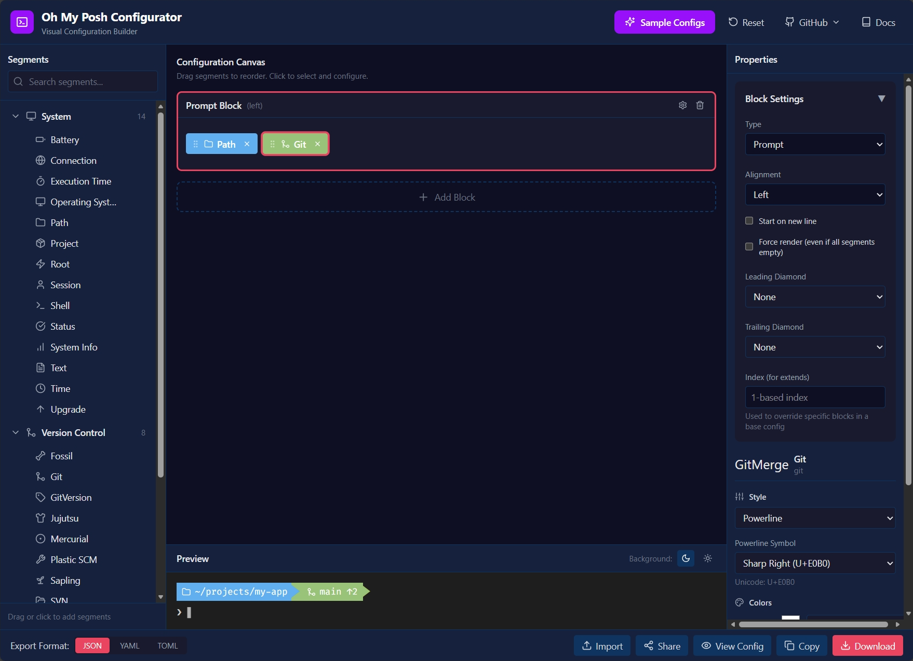
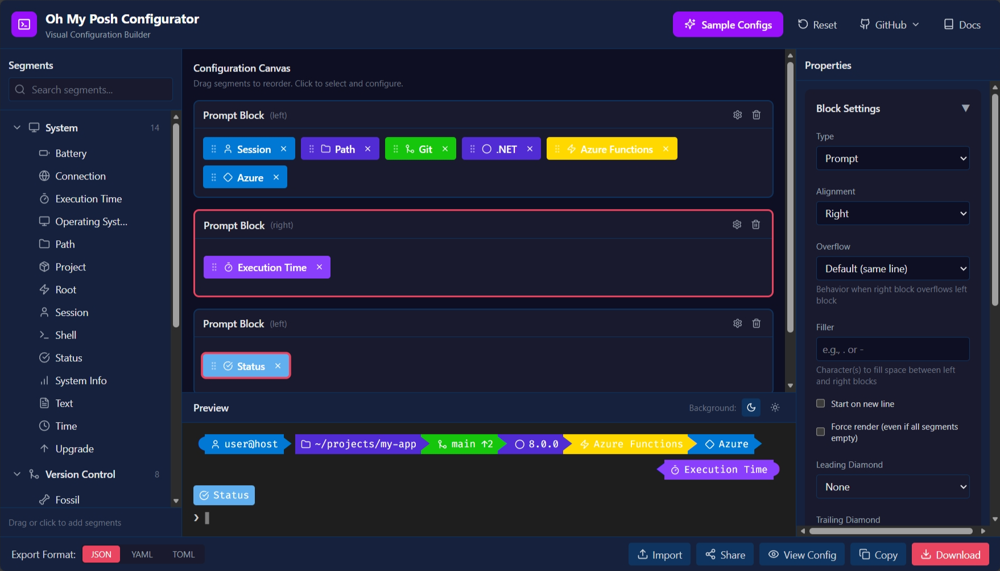
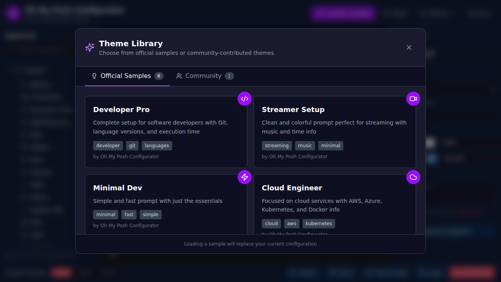
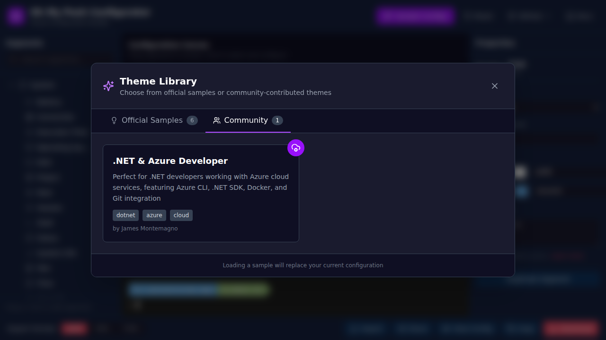
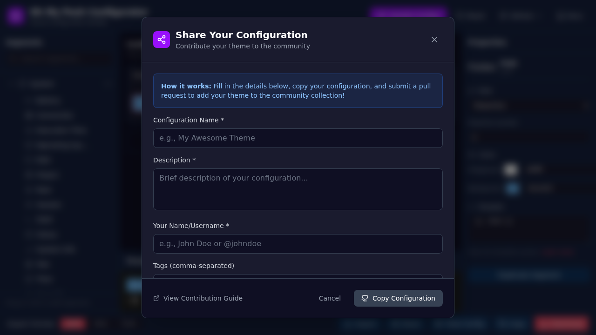

# Blog Images

This folder contains images for the Oh My Posh Visual Configurator blog posts.

## Available Images

### Main Interface

- **File**: `main-interface.png`
- **Description**: The complete Oh My Posh Configurator interface showing the segment picker on the left, configuration canvas in the center, and properties panel on the right, with a live preview at the bottom.
- **Usage**: Featured in the blog post introduction

### Properties Panel

- **File**: `properties-panel.png`
- **Description**: The properties panel showing segment customization options including style selection, color pickers, powerline symbol configuration, and template editing.
- **Usage**: Demonstrates the customization capabilities

### Segments Expanded

- **File**: `segments-expanded.png`
- **Description**: The Languages category expanded in the segment picker, showcasing 26+ programming language segments including .NET, Python, Go, Rust, Java, Node.js, PHP, Ruby, Swift, and many more.
- **Usage**: Shows the comprehensive segment library

### Sample Configs Dialog

- **File**: `sample-configs-dialog.png`
- **Description**: The Theme Library dialog showing official sample configurations and community-contributed themes with descriptions and tags.
- **Usage**: Demonstrates the sample configuration browser

### Community Themes

- **File**: `community-themes.png`
- **Description**: The Community tab in the Theme Library showing community-contributed configurations with details like ".NET & Azure Developer" theme.
- **Usage**: Highlights the community sharing feature

### Share Dialog

- **File**: `share-dialog.png`
- **Description**: The "Share Your Configuration" dialog with form fields for configuration name, description, author, and tags, along with step-by-step submission instructions.
- **Usage**: Shows how users can contribute their themes to the community

## Image URLs (GitHub Assets)

The images above are now stored locally in this repository for better version control and reliability.

**Previous GitHub Asset URLs (for reference):**
- Main Interface: `https://github.com/user-attachments/assets/86ee9e8d-7e4a-403a-9bf1-bd50b657b9d2`
- Properties Panel: `https://github.com/user-attachments/assets/6a644ff7-e698-4306-8d8a-60a92a52928c`
